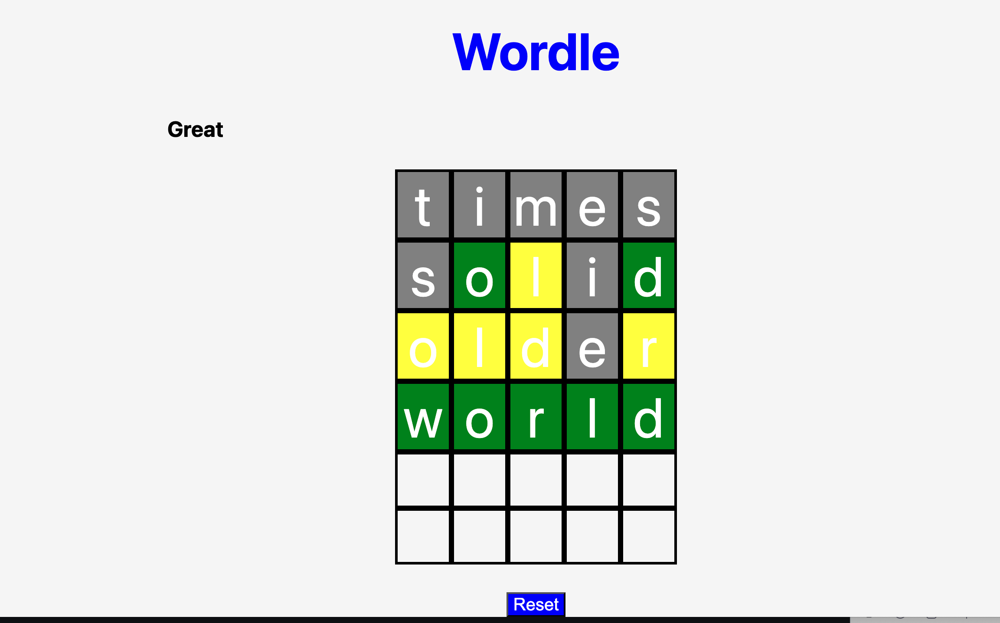

# Making a Wordle game in JavaScript

## Technologies Used
- JavaScript
- HTML
- CSS

##  Features
- 5x6 grid Wordle gameplay
- Color-coded scoring (green, yellow, grey)
- Keyboard event listener for input
- Word list imported from GitHub

## How to run locally:
- git clone https://github.com/yourusername/wordleboard.git
- cd in the file
- Open it with code . 
- Right click on the index.html file and click open in browser. 

## To make a Wordle game in Javascript you need to know some math.

## 1. Basic math

```javascript

 const calculateTileIndex = (row, column) => {
  let currentIndex = row * 5 + column;
  return currentIndex;
};

```
### The above code calculates the position of a letter in the grid using **Euclidean division**.  
In other words, the index in a 5-wide grid can be expressed as:

```javascript
index = divisor * quotient + remainder
```

### Which is itself derived from calculating rows and columns in such a manner:

```
row = ⌊index / 5⌋, 
column = index % 5 (and index = row * 5 + col) 
```


The row is “how many full groups of 5 fit into index” → the quotient of index ÷ 5 → row = ⌊index/5⌋.
The column is “what’s left over in that group of 5” → the remainder → col = index % 5.
Going the other way just rebuilds the count: index = row*5 + col.

>>Tip: Make sure to check out my pseudocode--[👉Click here for peudocode](https://github.com/eslteacher902010/wordle-pk/commit/cb4ec86b158033b4495ce4a50838b25567bd8dd0)

## Scoring

### One of the toughest functions I made was the scoring function. 

### Why so tough? Well. I had to come up with "flags" to mark certain letters as present in the right spot, present but in the wrong spot, or absent. Then I had to use those "flags" to change the color of the letters according to the Wordle schema: ***green***-right spot, right letter, ***yellow***-present but wrong spot, ***grey***-wrong letter. 


### Additionally, I had to come up with a way to process the guess in two passes. In the first pass, I used a reduce function to mark the green matches (correct letter, correct spot) and to build a frequency map of the remaining unmatched letters in the secret word.

### In the second pass, I looped through the guess again. For any position not already green, I checked the frequency map: if the letter still had a count left, I marked it yellow (present but wrong spot) and decremented the count; otherwise it stayed gray (absent).

### **Conceptionally**, this was almost as hard as the math part for me with columns and rows. 

### ***Scoring Function Shown Below***:

```javascript
const scoreGuess = (guess) => {
  let status = Array(5).fill('absent');
  const guessWord = guess.toLowerCase();
  const secretWord = targetWord.toLowerCase();

  const secretArrayLetters = secretWord.split('');

  if (guess.length === 5) {
    const remainingLetters = secretArrayLetters.reduce((acc, currentLetter, idx) => {
      if (guessWord[idx] === secretWord[idx]) {
        status[idx] = 'success'; // green
      } else {
        acc[currentLetter] = (acc[currentLetter] || 0) + 1;
      }
      return acc;
    }, {});

    // the yellow letters
    for (let i = 0; i < secretWord.length; i++) {
      if (status[i] !== 'success') {
        const letter = guessWord[i];
        if (remainingLetters[letter] > 0) {
          status[i] = 'present';
          remainingLetters[letter] -= 1;
        }
      }
    }

    let startRow = row * 5;
    let endRow = startRow + 5;

    for (let i = 0; i < 5; i++) {
      if (status[i] === 'success') {
        squareEls[startRow + i].style.backgroundColor = "green";
        squareEls[startRow + i].style.color = "white";
      } else if (status[i] === 'present') {
        squareEls[startRow + i].style.backgroundColor = "yellow";
        squareEls[startRow + i].style.color = "white";
      } else {
        squareEls[startRow + i].style.backgroundColor = "grey";
        squareEls[startRow + i].style.color = "white";
      }
    }
  }

  return status;
};
```

 >>Tip: Functions often perform actions, so naming with a verb can make it clear what the function does. Examples include fetchData( ), calculateArea( ), or printReport( ). 


## Next Steps
- It would be cool to actuallyhave blocks that flip. 
- Add more 5 letter words to guess I think. 

### For more information on Regex which I used in my code to get alphabet keys from the event listener, check out 👉 [MDN Doc](https://developer.mozilla.org/en-US/docs/Web/JavaScript/Guide/Regular_expressions). 

### To see the 5 letter word list I imported into my game from Github check out this link 👉 [5 letter words](https://darkermango.github.io/5-Letter-words/words.txt)